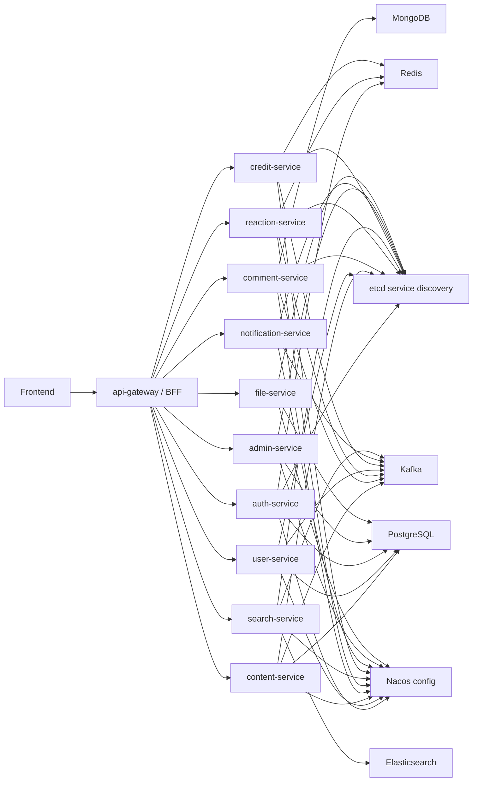

# Service Architecture

## Architectural Principles

1. Do not map every database table to a service. Services are organized by business capability.
2. Use gRPC for internal service-to-service calls.
3. Use `api-gateway` as the only public API boundary for the frontend.
4. Use Kafka for cross-service side effects and eventual consistency.
5. Avoid synchronous call chains for non-critical side effects such as notifications, search indexing, counters, and task rewards.
6. Each service owns its write model. Other services query through gRPC, denormalized read models, or events.

## Runtime Topology



## Services

### api-gateway

Responsibilities:

- Public HTTP API for frontend.
- Authentication middleware.
- Request validation and response normalization.
- Rate limiting and abuse protection.
- BFF aggregation for complex pages.
- Public file/proxy routes if needed.

Should not own business data.

Typical endpoints:

- `/api/auth/*`
- `/api/users/*`
- `/api/topics/*`
- `/api/articles/*`
- `/api/comments/*`
- `/api/search/*`
- `/api/admin/*`

### auth-service

Responsibilities:

- Password signup/signin/signout.
- Token/session lifecycle.
- Password reset.
- Email verification.
- SMS login.
- OAuth login and third-party binding.
- Captcha verification integration.

Data:

- `user_tokens`
- `third_users`
- `email_codes`
- `sms_codes`
- auth-related login audit metadata

Calls:

- `user-service` to create or bind user.
- `notification-service` for email/SMS send.
- Redis for session and verification throttling.

### user-service

Responsibilities:

- User profile.
- User public page data.
- User counts.
- Follow/fans relations.
- User status and mute state.
- User role projection.

Data:

- `users`
- `user_follows`
- `user_roles`
- optional user profile extensions

Publishes:

- `user.created`
- `user.updated`
- `user.followed`
- `user.unfollowed`
- `user.muted`

### content-service

Responsibilities:

- Topics/tweets/Q&A.
- Articles.
- Tags.
- Categories/nodes.
- Votes and vote options if votes remain content-owned.
- Hidden content.
- Topic attachments relation.
- Content lifecycle: draft, publish, audit, delete, recommend, sticky.
- QA status and accepted answer marker.

Data:

- `topics`
- `articles`
- `tags`
- `categories`
- `topic_tags`
- `article_tags`
- `votes`
- `vote_options`
- `vote_records` if content-owned
- `links`

Calls:

- `comment-service` for accepted answer validation.
- `credit-service` for QA bounty reserve/settlement.
- `file-service` for attachments.

Publishes:

- `content.topic.created`
- `content.topic.updated`
- `content.topic.deleted`
- `content.topic.audited`
- `content.article.created`
- `content.article.updated`
- `content.article.deleted`
- `content.qa.accepted`

### comment-service

Responsibilities:

- Comments and replies.
- Comment tree/list query.
- Comment images.
- Comment deletion and moderation status.
- Comment counters.
- Accepted-answer candidate data.

Data:

- MongoDB `comments` collection for comment body/tree.
- PostgreSQL optional `comment_index` table for moderation/query summaries.
- Redis counters for hot entities.

Publishes:

- `comment.created`
- `comment.deleted`
- `comment.audited`

### reaction-service

Responsibilities:

- Like/unlike.
- Favorite/unfavorite.
- Batch liked-id lookup.
- User favorite list.
- Vote casting can live here if treated as interaction.
- User report submission can either live here or `admin-service`; recommended split: submit here, audit in admin.

Data:

- `user_likes`
- `favorites`
- `vote_records` if votes are interaction-owned
- `user_reports` if report submission is interaction-owned

Redis:

- Entity like counters.
- User liked-id sets for hot entity types.
- Idempotency locks.

Publishes:

- `reaction.liked`
- `reaction.unliked`
- `reaction.favorited`
- `reaction.unfavorited`
- `reaction.reported`
- `vote.cast`

### search-service

Responsibilities:

- Topic search.
- Article search.
- User search.
- Search suggestions.
- Index rebuild jobs.
- Reindex status.
- SEO sitemap generation can live here or as a separate SEO job.

Data:

- Elasticsearch indices.
- PostgreSQL job metadata if needed.
- Redis hot query cache if needed.

Consumes:

- Content, user, comment, and reaction events.

### credit-service

Responsibilities:

- Check-in.
- Tasks and task progress.
- Points/score.
- Experience and level.
- Badges.
- Leaderboards.
- QA bounty reserve and settlement.
- Attachment download score deduction.

Data:

- `check_ins`
- `task_configs`
- `user_task_events`
- `user_task_logs`
- `user_score_logs`
- `user_exp_logs`
- `badges`
- `user_badges`
- `level_configs`

Consumes:

- Domain events such as signup, topic create, article create, comment create, accepted answer, like received, check-in.

Publishes:

- `credit.score.changed`
- `credit.exp.changed`
- `credit.level.changed`
- `credit.badge.granted`
- `credit.task.completed`

### notification-service

Responsibilities:

- Site messages.
- Interaction reminders.
- System notifications.
- Email send.
- SMS send or SMS delegation.
- Email logs.
- Per-notification-type delivery switches.

Data:

- `messages`
- `email_logs`
- notification delivery records

Consumes:

- User, content, comment, reaction, credit, admin events.

### admin-service

Responsibilities:

- Admin dashboard.
- RBAC roles and permissions.
- User governance.
- Content governance.
- Comment governance.
- Report audit.
- Forbidden words.
- Dictionaries.
- System settings control.
- Operation logs query.

Data:

- `roles`
- `permissions`
- `role_permissions`
- `dict_types`
- `dicts`
- `forbidden_words`
- admin operation metadata

Calls:

- Other services for actual mutations.
- `audit-service` for operate logs.

### config-service

Responsibilities:

- Public site configs.
- Admin configs.
- Module switches.
- Login config.
- Upload config.
- Notification config.
- About page/footer/nav settings.
- Script injection settings.

Data:

- `sys_configs`
- Nacos synchronized runtime config.

Note: Nacos is the runtime config center. `config-service` provides product-level config management and can write through to Nacos or load from PG and publish refresh events.

### file-service

Responsibilities:

- Image upload.
- Avatar/background/cover uploads.
- Topic attachment upload.
- Attachment metadata.
- Attachment download authorization.
- Object storage integration.

Data:

- `attachments`
- `attachment_download_logs`
- storage metadata

Storage backends:

- Local for development.
- S3-compatible backend for production.
- Optional Aliyun OSS, Tencent COS compatibility.

### audit-service

Responsibilities:

- Operation logs.
- Security-sensitive action records.
- Optional user behavior logs.

Data:

- `operate_logs`
- security audit records

Can be merged into `admin-service` initially, but keeping the boundary explicit helps later.

## Synchronous Calls Vs Events

Synchronous gRPC is appropriate for:

- Reading current user.
- Publishing content with immediate validation.
- Checking permissions.
- Loading page details.
- Authorizing attachment download.
- Accepting an answer and reserving/settling bounty.

Kafka events are appropriate for:

- Search indexing.
- Notification dispatch.
- Updating counters.
- Task progress.
- Score/experience rewards.
- Audit logs.
- Cache invalidation.

## Suggested Repository Layout Later

No code is created in this phase, but the future backend can use this shape:

```text
backend/
  api-gateway/
  services/
    auth/
    user/
    content/
    comment/
    reaction/
    search/
    credit/
    notification/
    admin/
    config/
    file/
    audit/
  proto/
  pkg/
    discovery/
    config/
    logging/
    errors/
    authctx/
    pagination/
  deployments/
  migrations/
```
