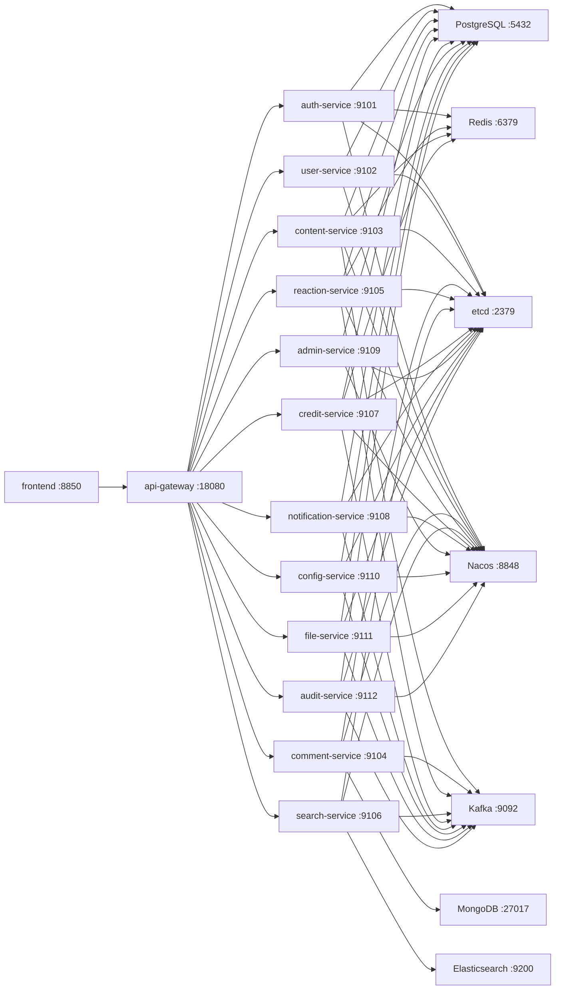

# Local Development Topology

This document defines the local development shape for the future backend implementation. It is a design artifact, not a Docker Compose file.

## Goals

- Let developers run the full P0 stack locally with predictable ports and names.
- Preserve microservice ownership boundaries without making local setup unnecessarily heavy.
- Use one local infrastructure cluster and many service processes.
- Keep local defaults close enough to production that configuration, discovery, events, and storage behavior are tested early.

## Assumptions

1. Infrastructure runs in containers.
2. Go services usually run from the host during development for faster rebuild/debug cycles.
3. Frontend keeps the existing `frontend` app and calls only `api-gateway`.
4. PostgreSQL starts as one local instance with independent logical databases or schemas per service.
5. Comments are stored in MongoDB from the beginning, not temporarily in PostgreSQL.
6. Nacos is used for runtime configuration; etcd is used for service discovery only.
7. Kafka topics are created explicitly in local bootstrap scripts instead of relying on implicit topic creation.

## Local Runtime Diagram



Some diagrammed services are reserved for later phases, but keeping them in the topology prevents port, discovery, and config naming drift.

## Infrastructure Services

| Component | Local Port | Purpose | Local Mode |
| --- | ---: | --- | --- |
| PostgreSQL | 5432 | Service-owned relational data | Single instance, multiple logical DBs/schemas |
| MongoDB | 27017 | Comment bodies and reply structure | Single node |
| Redis | 6379 | Sessions, counters, rate limits, hot sets | Single node |
| Elasticsearch | 9200, 9300 | Search projections | Single node, development security settings |
| Kafka | 9092 | Domain events | Single broker, KRaft mode preferred |
| Kafka UI | 8088 | Inspect topics and messages | Optional |
| etcd | 2379, 2380 | Service discovery | Single node |
| Nacos | 8848, 9848, 9849 | Runtime config | Standalone local mode |
| MinIO | 9000, 9001 | S3-compatible file storage | Optional until file-service starts |
| Mailpit | 1025, 8025 | Local email testing | Optional for password reset/email verification |

Notes:

- If a local machine already uses one of these ports, keep the logical service name and only change the port mapping.
- Nacos internal persistence is infrastructure-owned and is separate from product configuration stored by `config-service`.
- MinIO and Mailpit are optional for P0 core, but they prevent upload/email work from being blocked later.

## Backend Service Ports

| Service | HTTP Port | gRPC Port | Notes |
| --- | ---: | ---: | --- |
| `api-gateway` | 8080 | - | Only public backend boundary for frontend |
| `auth-service` | - | 9101 | Auth/session/password flows |
| `user-service` | - | 9102 | User profile and follows |
| `content-service` | - | 9103 | Topics, articles, categories, tags |
| `comment-service` | - | 9104 | MongoDB comments |
| `reaction-service` | - | 9105 | Likes, favorites, reports |
| `search-service` | - | 9106 | Elasticsearch indexing/search |
| `credit-service` | - | 9107 | Deferred after P0 core |
| `notification-service` | - | 9108 | Site messages and delivery |
| `admin-service` | - | 9109 | Governance and permissions |
| `config-service` | - | 9110 | Product config management |
| `file-service` | - | 9111 | Uploads and attachments |
| `audit-service` | - | 9112 | Operation/security logs |

P0 can start only the services needed for the current vertical slice. The port registry should still reserve all service ports to avoid churn.

## PostgreSQL Local Layout

Recommended local default:

```text
postgres instance
  database/schema: bbs_auth
  database/schema: bbs_user
  database/schema: bbs_content
  database/schema: bbs_reaction
  database/schema: bbs_credit
  database/schema: bbs_notification
  database/schema: bbs_admin
  database/schema: bbs_config
  database/schema: bbs_file
  database/schema: bbs_audit
```

Rules:

1. A service gets credentials only for its own logical database/schema.
2. Local migrations run per service, not as one global migration.
3. No local foreign keys cross service boundaries.
4. Admin/debug SQL can use elevated local credentials, but application services should not.

If the migration framework makes per-database setup expensive at first, use one `bbs` database with separate schemas. Keep table names and migration ownership service-scoped so moving to separate databases later is mechanical.

## MongoDB Local Layout

Database:

```text
bbs_comment
```

Collections:

```text
comments
comment_audit_logs
```

Required bootstrap work:

- Create indexes defined in `09-p0-schema-draft.md`.
- Add a small seed document only if integration tests require it.
- Do not mirror comment bodies into PostgreSQL.

## Elasticsearch Local Layout

Indices:

```text
bbs_topics
bbs_articles
bbs_users
bbs_tags
```

Required bootstrap work:

- Apply the P0 mappings from `09-p0-schema-draft.md`.
- Keep index writes owned by `search-service`.
- Rebuild indices from PostgreSQL/MongoDB through service APIs or planned jobs, not direct cross-service SQL joins.

## Kafka Local Layout

Topic names should match `04-event-contracts.md`.

Initial P0 topics:

```text
content.topic.created
content.topic.updated
content.topic.deleted
content.article.created
content.article.updated
content.article.deleted
comment.created
comment.deleted
reaction.liked
reaction.unliked
reaction.favorited
reaction.unfavorited
reaction.reported
user.created
user.updated
user.followed
user.unfollowed
admin.config.changed
admin.forbidden_word.changed
audit.operation.recorded
```

Dead letter topics:

```text
dlq.search
dlq.notification
dlq.credit
dlq.audit
```

Local defaults:

- One partition is acceptable for early local development.
- Use at least three partitions for topics that will later carry high-volume interaction events.
- Consumers must be idempotent even locally.
- Consumer group names should match the planning document: `search-indexer`, `notification-dispatcher`, `credit-task-engine`, `counter-projector`, `audit-writer`.

## etcd Discovery

Recommended service registration shape:

```text
/bbs/{env}/services/{serviceName}/{instanceId}
```

Value sketch:

```json
{
  "name": "content-service",
  "address": "127.0.0.1",
  "grpcPort": 9103,
  "version": "dev",
  "metadata": {
    "zone": "local"
  }
}
```

Rules:

- Each service registers itself on startup with a TTL lease.
- Health failure or process exit should remove the instance through lease expiry.
- `api-gateway` discovers gRPC services through etcd, not hardcoded host lists after the bootstrap phase.

## Nacos Configuration

Recommended namespace and groups:

```text
namespace: bbs-local
group: BBS_LOCAL
```

Recommended data IDs:

```text
bbs-common.yaml
bbs-api-gateway.yaml
auth-service.yaml
user-service.yaml
content-service.yaml
comment-service.yaml
reaction-service.yaml
search-service.yaml
notification-service.yaml
admin-service.yaml
```

Configuration precedence:

1. Process environment: bootstrapping values and secrets.
2. Nacos service config.
3. Nacos common config.
4. Local development defaults inside the service.

Environment variables should be enough to find Nacos and etcd:

```text
BBS_ENV=local
SERVICE_NAME=content-service
SERVICE_GRPC_PORT=9103
NACOS_ADDR=127.0.0.1:8848
NACOS_NAMESPACE=bbs-local
NACOS_GROUP=BBS_LOCAL
ETCD_ENDPOINTS=127.0.0.1:2379
```

Do not store production secrets in Nacos planning examples or repository files. Local secrets can use environment variables or untracked local files.

## Startup Order

Recommended local bootstrap order:

1. Start infrastructure: PostgreSQL, MongoDB, Redis, Kafka, etcd, Nacos, Elasticsearch.
2. Create PostgreSQL logical databases/schemas and service users.
3. Run PostgreSQL migrations per service.
4. Create MongoDB indexes.
5. Create Elasticsearch mappings.
6. Create Kafka topics.
7. Seed admin role, public config, default category, and optional demo user.
8. Start core services: `auth-service`, `user-service`, `content-service`.
9. Start supporting services: `comment-service`, `reaction-service`, `search-service`, `notification-service`, `admin-service`.
10. Start `api-gateway`.
11. Start `frontend`.

For early implementation, a reduced slice is acceptable:

```text
PostgreSQL + Redis + etcd + Nacos
auth-service + user-service + api-gateway + frontend
```

Then add MongoDB/comment, Kafka/search, and admin governance as vertical slices land.

## Health Checks

Each backend service should expose or support:

- gRPC health checking.
- A startup check for PostgreSQL/MongoDB/Redis/Elasticsearch dependencies it owns.
- Nacos config load status.
- etcd registration status.
- Kafka producer/consumer readiness when the service uses events.

`api-gateway` health should distinguish:

- Process alive.
- Discovery connected.
- Required P0 services reachable.

## Local Test Slices

Use vertical slices instead of trying to verify all infrastructure at once.

### Slice A: Auth And Profile

Required:

- PostgreSQL
- Redis
- Nacos
- etcd
- `auth-service`
- `user-service`
- `api-gateway`
- `frontend`

Acceptance:

- User can register, sign in, read current profile, and sign out.

### Slice B: Topic Publishing

Add:

- `content-service`
- Kafka
- Elasticsearch
- `search-service`

Acceptance:

- User can publish a topic.
- Topic appears in feed.
- Topic is indexed asynchronously and searchable.

### Slice C: Comments And Reactions

Add:

- MongoDB
- `comment-service`
- `reaction-service`
- `notification-service`

Acceptance:

- User can comment, like, favorite, and receive a basic site message.
- Counters update through Redis/event projection and can reconcile back to storage.

### Slice D: Minimal Admin Governance

Add:

- `admin-service`
- `audit-service`

Acceptance:

- Admin can mute a user, audit/delete content, handle a report, and see an operation log.

## Repository Layout Implication

When implementation starts, topology assets should live under backend deployment paths, for example:

```text
backend/
  deployments/
    local/
      docker-compose.yaml
      nacos/
      kafka/
      postgres/
      elasticsearch/
  migrations/
    auth/
    user/
    content/
    reaction/
    notification/
    admin/
    config/
    audit/
```

This keeps deployment files separate from service code and preserves migration ownership.

## Locked Local Decisions

1. Use one local PostgreSQL instance with separate service schemas first; keep service credentials scoped.
2. Use Nacos standalone local mode first; production can use proper external storage.
3. Run infrastructure in containers and Go service processes on the host during development.
4. Include MinIO and Mailpit in local topology but keep dependent service flows optional.
5. Point frontend dev proxy to `api-gateway` once the backend skeleton exists; use mock data only before that.
