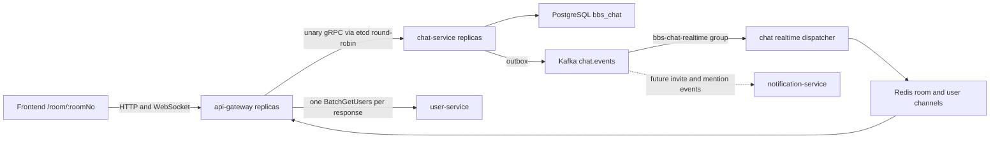

# Chat Service Architecture

## Scope

The first release provides authenticated, plain-text group chat at
`/room/:roomNo` with:

- room creation and exact room-number lookup;
- idempotent join by room number or shared link;
- user-owned room groups and ordering synced across devices;
- a sidebar with room summaries and authoritative unread counts;
- message history anchored at the last-read sequence;
- real-time send, receive, acknowledgement, and read advancement;
- owner-managed room announcements with per-member seen versions.

The first release does not add chat-specific infrastructure, attachments,
full-text search, presence, typing indicators, reactions, message threads, or
audio/video. It reuses the existing PostgreSQL, Redis, Kafka, Nacos, and etcd
instances. It does not use MinIO or Elasticsearch.

## Decisions And Corrections

This design combines the earlier proposals with these corrections:

1. WebSocket connections terminate at `api-gateway`. They are not proxied or
   bridged as long-lived streams to a selected `chat-service` instance.
   Commands use unary gRPC and real-time events return through Redis. This keeps
   `chat-service` stateless and lets the existing etcd round-robin client move
   every command independently between service instances.
2. `chat-service` returns user IDs and never calls `user-service` while listing
   rooms or messages. `api-gateway`, as the BFF, collects unique IDs and performs
   one `BatchGetUsers` call per response. WebSocket clients use a coalescing
   batch loader for previously unknown user IDs. Per-room and per-message user
   lookups are forbidden.
3. Database transactions write an outbox row. Competing outbox workers publish
   to Kafka with `FOR UPDATE SKIP LOCKED`; a `bbs-chat-realtime` consumer group
   then publishes the durable event to Redis. A database commit is never
   followed by an untracked direct Pub/Sub-only notification.
4. A sender's `last_read_seq` advances to the sequence of their own message in
   the same transaction. Otherwise the sender would create unread messages for
   themselves.
5. Redis uses room channels for shared events and user channels for cross-device
   read and membership changes. Redis is transport only; PostgreSQL cursors are
   authoritative.
6. `notification-service` may consume future invite or mention events. It must
   not create a site notification for every chat message in the first release.

## Runtime Topology



`chat-service` uses Nacos for configuration and registers
`bbs-chat-service` on gRPC port `9116` in the existing etcd cluster. Multiple
instances share the same PostgreSQL schema, Kafka topic, and Redis namespace.
No instance-local business state is required.

Every concurrently running instance must receive a unique Snowflake worker ID
in `[0, 1023]` through `BBS_CHAT_SNOWFLAKE_WORKER_ID` (for example, a stable
orchestrator ordinal). Local instance one defaults to `16`; a second local
instance must use another value such as `17`.

## Ownership And Data Model

`chat-service` exclusively owns schema `bbs_chat` and these tables.

### chat_rooms

| Column | Purpose |
| --- | --- |
| `id BIGINT` | Snowflake primary key. |
| `room_no VARCHAR(12)` | Immutable, case-insensitive, human-shareable room number; unique. |
| `name VARCHAR(80)` | Room display name. |
| `creator_id BIGINT` | Owner user ID; cross-service reference without a foreign key. |
| `announcement TEXT` | Current announcement. |
| `announcement_version BIGINT` | Monotonically increasing version, initially zero. |
| `last_message_seq BIGINT` | Last allocated room message sequence, initially zero. |
| `status SMALLINT` | Active or closed. |
| timestamps | Creation and update times. |

Room numbers are generated from an unambiguous uppercase alphabet, normalized
before lookup, and retried on unique conflict. Search is exact only.

### chat_room_groups

| Column | Purpose |
| --- | --- |
| `id BIGINT` | Snowflake primary key. |
| `user_id BIGINT` | Group owner. |
| `name VARCHAR(40)` | User-visible group name. |
| `sort_order INTEGER` | Stable cross-device ordering. |
| timestamps | Creation and update times. |

Group names are unique per user after normalization. A unique `(id, user_id)`
constraint supports ownership-safe membership references.

### chat_room_members

| Column | Purpose |
| --- | --- |
| `room_id BIGINT` | Room reference. |
| `user_id BIGINT` | Member user ID. |
| `role SMALLINT` | Owner or member. |
| `status SMALLINT` | Joined or left. |
| `joined_at_seq BIGINT` | Room sequence at the latest join. |
| `last_read_seq BIGINT` | Authoritative monotonic read cursor. |
| `last_seen_announcement_version BIGINT` | Announcement popup cursor. |
| `group_id BIGINT NULL` | Optional user-owned group. |
| `sort_order INTEGER` | Order inside the selected group. |
| timestamps | Join, leave, creation, and update times. |

The primary key is `(room_id, user_id)`. A composite foreign key from
`(group_id, user_id)` to `chat_room_groups(id, user_id)` prevents assigning a
room to another user's group.

### chat_messages

| Column | Purpose |
| --- | --- |
| `id BIGINT` | Snowflake message ID. |
| `room_id BIGINT` | Owning room. |
| `seq BIGINT` | Continuous sequence within the room. |
| `sender_id BIGINT` | Sending member. |
| `client_message_id UUID` | Client retry idempotency key. |
| `body TEXT` | Plain-text body in the first release. |
| `status SMALLINT` | Published or deleted tombstone. |
| timestamps | Creation, update, and optional deletion times. |

Unique constraints are `(room_id, seq)` and
`(room_id, sender_id, client_message_id)`. Deleted messages remain as
tombstones, so sequence-based unread counts never drift.

### chat_outbox

| Column | Purpose |
| --- | --- |
| `event_id UUID` | Event idempotency key. |
| `aggregate_type`, `aggregate_id` | Room/message routing metadata. |
| `event_type`, `event_version` | Versioned contract identifier. |
| `partition_key` | Room ID so Kafka preserves room order. |
| `payload JSONB` | Event envelope payload. |
| `status`, `attempts`, `next_attempt_at` | Retry state. |
| `published_at`, timestamps | Delivery and audit metadata. |

Workers claim bounded batches with `FOR UPDATE SKIP LOCKED`. Kafka delivery is
at least once; `event_id`, message ID, room sequence, and client message ID make
consumers and clients idempotent.

## Transaction Invariants

### Create Room

One transaction creates the room and its owner membership. The owner's
`joined_at_seq`, `last_read_seq`, and announcement cursor start at zero.

### Join Room

`POST /api/v1/chat/rooms/:roomNo/join` is idempotent. A new or rejoining member
receives the current `last_message_seq` as both `joined_at_seq` and
`last_read_seq`. Existing history remains queryable but is not initially
unread. A membership event is written to the outbox. Join and send commands
lock the room row before the relevant membership row so they use one consistent
lock order.

### Send Message

The send transaction performs these operations in order:

1. lock the room, then lock and validate the active membership;
2. return the existing message when the client idempotency key already exists;
3. atomically increment `chat_rooms.last_message_seq` and obtain the new value;
4. insert the message with that sequence;
5. advance the sender's `last_read_seq` to the new sequence;
6. insert `chat.message.created.v1` into `chat_outbox`;
7. commit.

Concurrent messages in one room serialize on the room row. Different rooms do
not block each other. A conflict rolls back the sequence increment, preserving
continuous sequences.

### Advance Read Cursor

The server clamps the requested cursor to the room's current
`last_message_seq`, rejects non-members, and updates with
`GREATEST(last_read_seq, requested_seq)`. A `chat.read.advanced.v1` event keeps
the same user's other active browser sessions synchronized.

Unread count is always:

```text
max(0, chat_rooms.last_message_seq - chat_room_members.last_read_seq)
```

Redis sorted sets are not an unread source of truth. They may be introduced
later only as a rebuildable optimization after measurements justify them.

### Update Announcement

Only the active room owner may update the announcement. The transaction
increments `announcement_version` and writes
`chat.announcement.updated.v1`. Closing the popup advances the member's seen
version monotonically; the announcement remains available from the room UI.

## Public HTTP Contract

All routes are served by `api-gateway` under `/api/v1`.

| Method and path | Purpose |
| --- | --- |
| `POST /chat/rooms` | Create a room. |
| `GET /chat/rooms/lookup?room_no=` | Exact safe room preview lookup. |
| `GET /chat/rooms/:roomNo` | Load room and current membership state. |
| `POST /chat/rooms/:roomNo/join` | Idempotently join. |
| `GET /chat/sidebar` | Return groups, room summaries, last messages, and unread counts. |
| `GET /chat/rooms/:roomNo/messages` | Load anchored or directional message pages. |
| `POST /chat/rooms/:roomNo/messages` | Idempotent HTTP send fallback and E2E entry point. |
| `PUT /chat/rooms/:roomNo/read` | Advance `read_seq`. |
| `POST /chat/groups` | Create a private room group. |
| `PATCH /chat/groups/:groupId` | Rename or reorder a group. |
| `DELETE /chat/groups/:groupId` | Delete an empty group or move its rooms to ungrouped. |
| `PUT /chat/rooms/:roomNo/placement` | Move and order a room in the sidebar. |
| `PATCH /chat/rooms/:roomNo/announcement` | Owner update. |
| `PUT /chat/rooms/:roomNo/announcement-seen` | Advance seen announcement version. |
| `POST /chat/ws-tickets` | Create a short-lived, single-use ticket. |
| `GET /chat/ws?ticket=` | Upgrade to WebSocket. |

Message pagination modes are mutually exclusive:

- `anchor_seq`, `before`, and `after` load the initial window around the
  last-read position;
- `before_seq` loads older messages;
- `after_seq` loads newer messages and reconnect gaps.

Each response includes `latest_seq`, directional continuation flags, and the
effective anchor. The frontend anchors the last-read message and displays an
unread separator before `last_read_seq + 1`.

`GET /chat/sidebar` is one BFF operation implemented with a fixed, bounded
number of set-based SQL queries. It never issues one query per room. The gateway
collects creator, sender, and other visible user IDs and performs at most one
`BatchGetUsers` request for the response.

## WebSocket And Cluster Delivery

The browser obtains a ticket through an authenticated HTTP request. The ticket
contains a random ID, user ID, issue time, and expiry no longer than 60 seconds.
Redis stores the random ID with TTL. Upgrade consumes it atomically, making the
ticket single use and keeping the long-lived bearer token out of URLs and
access logs.

Each gateway replica owns only its local socket hub:

- one reader and one writer loop per connection;
- bounded outbound queues and disconnect-on-backpressure;
- ping/pong deadlines and frame/body limits;
- local user and room subscription maps with reference counts;
- Redis subscriptions only for users and rooms represented by local sockets.

The client subscribes to the rooms returned by `/chat/sidebar`. The gateway
batch-validates all requested room memberships through one gRPC call before
subscribing. It never trusts client-supplied room numbers.

Client events:

- `room.subscribe`
- `message.send`
- `read.advance`

Server events:

- `message.created`
- `message.ack`
- `room.unread.changed`
- `read.advanced`
- `announcement.updated`
- `resync.required`

Room events use `chat:room:{roomId}` Redis channels. Cross-device read and
membership events use `chat:user:{userId}` channels. Every event carries
`event_id`, `room_id`, and the relevant sequence/version. The gateway and
frontend deduplicate events.

A Redis disconnect or gateway restart may lose transient delivery, but not
messages. On reconnect the client compares its latest sequence with
`latest_seq` and requests `/messages?after_seq=...`. Sequence gaps trigger the
same repair. WebSocket load balancing does not require sticky sessions beyond
the lifetime of the upgraded TCP connection.

## Security And Limits

- Every command derives `user_id` from gateway authentication or the consumed
  WebSocket ticket; client-supplied user IDs are ignored.
- Membership and owner checks are enforced in `chat-service`, not only in the
  frontend or gateway.
- Room preview exposes only room number, name, status, and safe counts.
- Plain-text message bodies are trimmed, non-empty, and capped at 4,000 Unicode
  code points; announcement and room name limits are enforced server-side.
- Message send and join operations use existing Redis-backed gateway rate
  limiting. Business idempotency remains in PostgreSQL.
- Logs and metrics do not record message bodies, bearer tokens, or WebSocket
  tickets.

## Delivery Plan And Verification

Each phase is a separate commit.

1. Architecture document.
2. `chat-service` schema, migrations, domain/application service, PostgreSQL
   repository, gRPC contract, config, Nacos config, etcd registration, and unit
   tests.
3. Gateway chat client, REST routes, authorization, set-based user hydration,
   and API integration tests.
4. Outbox worker, Kafka topic/consumer, Redis dispatcher, gateway WebSocket hub,
   ticket consumption, reconnect repair tests, and a two-instance cluster test.
5. Frontend `/room/:roomNo`, sidebar grouping, anchored history, unread state,
   announcement dialog, coalesced user batch loader, and component tests.
6. Real browser commercial E2E against the existing infrastructure: two users,
   two chat instances, join by link and exact lookup, idempotent resend, ordered
   concurrent messages, cross-instance delivery, reconnect gap repair,
   cross-device read state, grouping, announcement popup, and an assertion that
   no per-message or per-room user-detail N+1 requests occur.

Local development must reuse the already running PostgreSQL, Redis, Kafka,
Nacos, and etcd services. The BBS Compose file remains free of duplicate stateful
dependencies.
